# Overview
This example is based upon [Google Codelabs](https://codelabs.developers.google.com) demonstrating 

A. the instance autoscaling in [Google Cloud Run](https://cloud.google.com/run) and

B. a statefull and stateless webservice.

The code creates a basic web service responding to HTTP GET requests.

# About Google Cloud run
[Google Cloud Run](https://cloud.google.com/run) is a managed compute platform that enables you to run stateless containers that are invocable via HTTP requests. It is built on the Knative open-source project, enabling portability of your workloads across platforms. Cloud Run is serverless: it abstracts away all infrastructure management, so you can focus on what matters most — building great applications.

# I. Demonstration of elasticity and instance autoscaling

## a. Setup
Steps in a nutshell to perform before deploying a basic web service on Google Cloud Run (for full details please refer to https://codelabs.developers.google.com/codelabs/cloud-run-hello-python3?hl=en#1)

1. Sign-in to the Google Cloud Console and create a new project or reuse an existing one.

2. Start Cloud Shell

3. Run the following command in the Cloud Shell to confirm that you are authenticated: 
`gcloud auth list`

4. Set project to work with gcloud:
`gcloud config set project <PROJECT_ID>`

This should output:
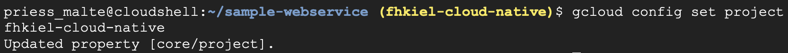

5. Confirm:
`gcloud config list project`

This should output:
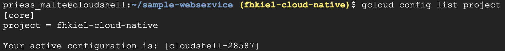

6. [Cloud Build](https://cloud.google.com/build) automatically builds a container image from your source code and pushes it to [Artifact Registry](https://cloud.google.com/artifact-registry). Artifact Registry manages your container image.

For this to work we need to enable the Artifact Registry, Cloud Build, and Cloud Run APIs.

```
gcloud services enable \
  artifactregistry.googleapis.com \
  cloudbuild.googleapis.com \
  run.googleapis.com
```

## b. Write application
- Create working directory 'sample-webservice' 
- Create main file `main.py` or use the one from this GitHub repo
- Create `requirements.txt`for python libraries
- Create `Procfile`neccessary for Cloud Run to specify how the application will be served:
`web: gunicorn --bind :$PORT --workers 1 --threads 8 --timeout 0 main:app`

## c. Deployment

Deploy the application to Cloud Run:
```
gcloud run deploy $SERVICE_NAME \
  --source $WORKDIR \
  --platform managed \
  --region $REGION \
  --allow-unauthenticated
```

where `SERVICE_NAME` could be anything, e.g., the name of our working directory `sample-webservice` and `REGION` is set, either for specific usage `REGION="europe-west9"` or as a default region `gcloud config set run/region $REGION`.
`WORKDIR` is the path to the directory containing application files.

This should output:
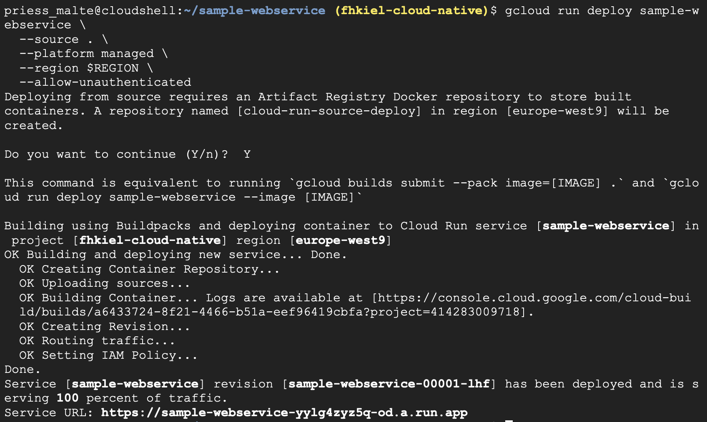

`gcloud run deploy` firstly creates a Artifact Registry Docker repository named `cloud-run-source-deploy` in the specified region in order to store the built container. 

It then automatically builds a container image from the specified source code (option `--source`) and pushes the image to the created Artifact Registry repository.

The service will be available via the displayed service URL. You can also get the service URL with this command:
```
SERVICE_URL=$( \
  gcloud run services describe $SERVICE_NAME \
  --platform managed \
  --region $REGION \
  --format "value(status.url)" \
)
```

## d. Test the service
Just apply simple GET request opening service URL or via curl: 
- `curl $SERVICE_URL` or
- `curl $SERVICE_URL?who=007`

This should output:
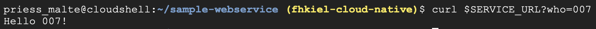

## e. Demonstrating the instance autoscaling in Google Cloud Run
a. We increase the max number of instances for the deployed service to a higher number.

We might furthermore set the maximum number of simultaneous requests per instance (services) to, e.g., 5. This triggers even more easily the instance autoscaling. This is for demonstration purposes only. Default value should be 80. Please adapt the gcloud command below according to your needs

Note that if using more demanding functions such as the deep learning example (classifying fashion MNIST data) memory might hast to be increased, here 2048MB are required in order to be able to train for ten epochs.
```
gcloud run services update $SERVICE_NAME \
--region $REGION \
--max-instances 10
--concurrency 5
--memory 2048Mi
```

b. You can check the updated setting of the service:
```
gcloud run services describe $SERVICE_NAME \
--region $REGION \
--format export
```

or by looking at the web interface of the deployed service in Google Cloud Run, section "YAML"
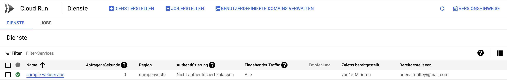
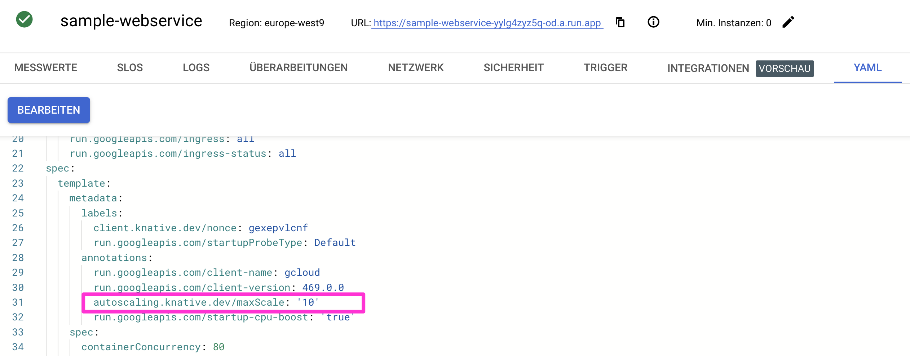
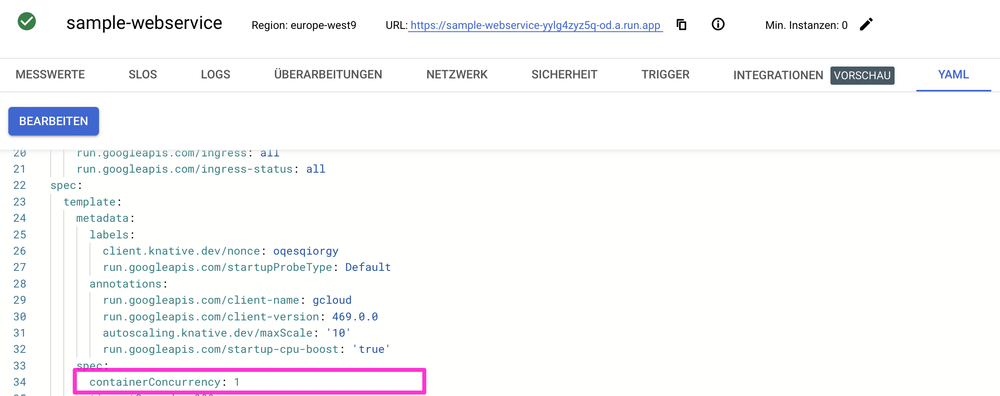

c. Simulate a higher load through several user requests by submitting response via one of the provided curl scripts:
```
for ((i=1;i<=200;i++)); do ./curl_simpleGET.sh & done
for ((i=1;i<=20;i++)); do ./curl_perfNr.sh & done
for ((i=1;i<=20;i++)); do ./curl_fashionMNIST_MLP.sh & done
```
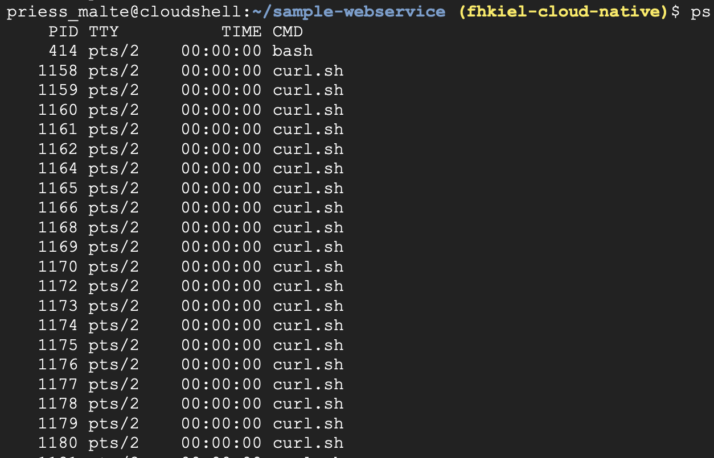

d. Observe the behavior of the provided ressources at the Cloud Run dashboard of the deployed service under section "METRICS", here specifically look at "Container instance count".

You should observe an increase in the number of instances over execution of the above requests:
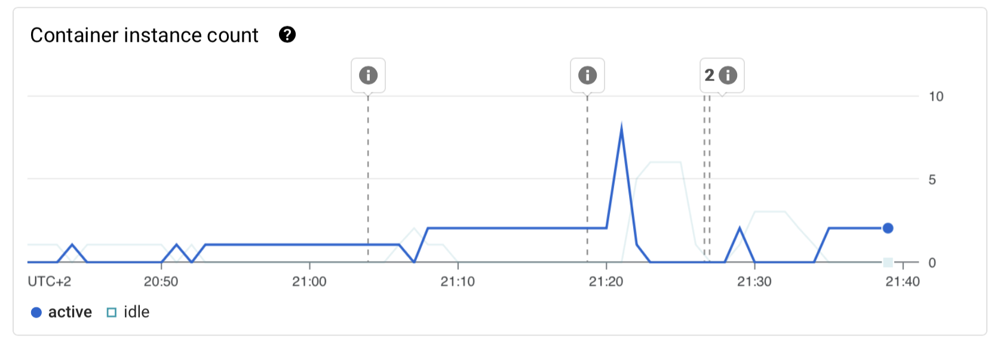
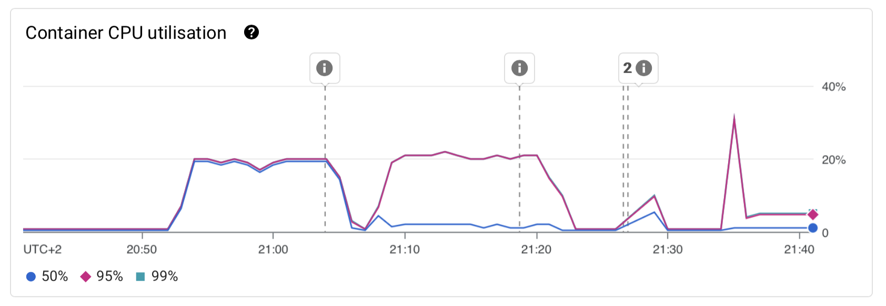
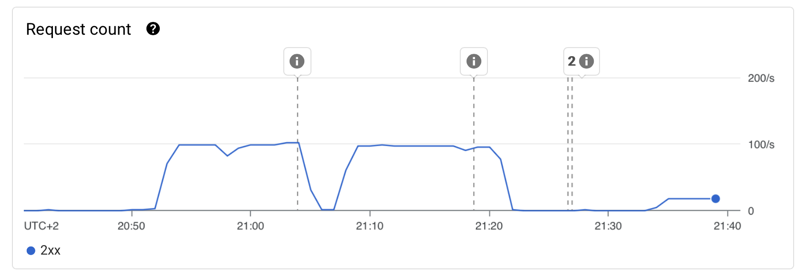

# II. Demonstration of stateless webservice
Components in a cloud-native architecture should be designed to be stateless. 

If the state should be available throughout requests, an application independant cache - such as Redis in-memory database - to store and retrieve user state should be used instead of an instance depedendant memory. Here, a simple shopping cart list, which can be populated with items and be retrieved using simple POST and GET methods is used for demonstration purposes.

## a. Setup in Google Cloud Run
You can access Redis from a service running on Cloud Run through a managed Redis service like Google Cloud Memorystore

You can use the [Cloud Run integrations](https://cloud.google.com/run/docs/integrate/redis-memorystore) feature for a simplified way to connect to a new Redis instance. Note the Cloud Run integrations is [only supported in certain regions](https://cloud.google.com/run/docs/locations#integrations).

Otherwise follow the steps described [here](https://cloud.google.com/memorystore/docs/redis/connect-redis-instance-cloud-run) to connect to a Redis instance from a Cloud Run service.

<!-- 
Create a Google Cloud Memorystore:
1. Go to the Google Cloud Console.
2. Navigate to Memorystore and select Redis.
3. Click on Create Instance.
4. Configure your Redis instance, including the name, region, tier, and capacity.
5. Click Create to deploy your Redis instance.
(this can also be realized throught code, e.g., run
```
gcloud redis instances create --project=fhkiel-cloud-native  test-redis --tier=basic --size=1 --region=europe-west9 --redis-version=redis_5_0 --network=projects/fhkiel-cloud-native/global/networks/default --connect-mode=DIRECT_PEERING --display-name="test-redis"
```
)
6. After the instance is created, obtain your instance's IP address (can be found unter connection properties of the redis instance)

Deploy the application to Cloud Run:
```
gcloud run deploy $SERVICE_NAME \
  --source $WORKDIR \
  --platform managed \
  --region $REGION \
  --allow-unauthenticated
  --network $NETWORK \
  --subnet $SUBNET \
  --set-env-vars REDISHOST=$REDIS_IP,REDISPORT=$REDIS_PORT
```

where 

- NETWORK is the name of the authorized VPC network that your Redis instance is attached to.
- SUBNET is the name of your subnet.
- REDIS_IP and REDIS_PORT are the IP address and port number of your Redis instance. 
-->

The following curl commands can be used to submit a POST and GET request to test the webservice.

## b. Accessing the exemplary (statefull) webservice using local memory
```
curl -X POST $SERVICE_URL/add_to_cart_locMem -H 'Content-Type: application/json' -d '{"item": "Shirt"}'
curl -X POST $SERVICE_URL/add_to_cart_locMem -H 'Content-Type: application/json' -d @shopping.json 
curl $SERVICE_URL/get_cart_logMem
```

## c. Accessing the exemplary (stateless) webservice using redis in-memory database
```
curl -X POST $SERVICE_URL/add_to_cart_redis -H 'Content-Type: application/json' -d '{"item": "Shirt"}'
curl -X POST $SERVICE_URL/add_to_cart_redis -H 'Content-Type: application/json' -d @shopping.json 
curl $SERVICE_URL/get_cart_redis
```

# III. Clean up
You can delete your repository or delete your Cloud project to avoid incurring charge.

To delete your container image repository:
```
gcloud artifacts repositories delete cloud-run-source-deploy \
  --location $REGION
```

To delete your Cloud Run service:
```
gcloud run services delete $SERVICE_NAME \
  --platform managed \
  --region $REGION
```

Alternatively, you can delete your Google Cloud project which stops billing for all the resources used within that project.

```
PROJECT_ID=$(gcloud config get-value core/project)
gcloud projects delete $PROJECT_ID
```